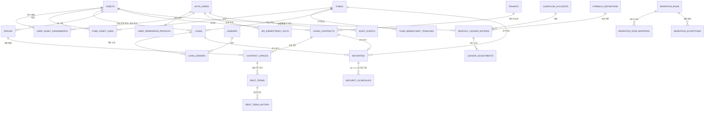

# Gate 6 데이터·API SDD

문서 상태: **R0 PASS · R1 PARTIAL — 공통 구현 진척·운영 활성화 금지**
작성 기준일: 2026-08-04
적용 범위: 신규 `logistics_core`, `logistics_api`, v2 API, 권한, 계산, 만기·인앱 알림 계약

## 1. 목적과 구현 금지선

이 문서는 새 물류센터 데이터 관리 플랫폼의 서버 측 단일 계약입니다. 신규 화면은 이 계약만 사용하며, 기존 `public.ll_*` 테이블을 직접 조회하거나 수정하지 않습니다.

현재 복구 readback 기준은 다음과 같습니다.

- 운영 `public.ll_*`: 27개 테이블, 총 27,512행
- Gate 6 애플리케이션 선택 restore: 375개 객체, 종료 코드 0
- 동일 dump snapshot: 테이블 행 수 27/27, 전체 열 content hash 27/27 일치
- 운영-vs-dump 동적 테이블 해시: 24/27 일치이며 cutover 직전 동일 snapshot에서 재검증
- Auth 사용자: 운영 13명, 로컬 복원 13명, 직원·권한 연결 parity 확인
- Supabase 관리 확장 4개는 플랫폼 책임으로 분리하고 Gate 6 소유 객체 복구와 구분
- Storage metadata·원본: 운영 49개, 로컬 복원·다운로드 49개
- Storage 원본: 49/49 다운로드, 총 113,226,015바이트, 파일별 SHA-256 검증 완료

사용자 결정에 따라 별도 Preview branch는 만들지 않습니다. 구현은 격리 Git worktree에서 TDD로 진행하고, 운영 migration은 기존 객체를 수정하지 않는 `logistics_core`·`logistics_api` additive schema로 제한합니다. R1과 로컬 리허설 통과 뒤 외부 grant·writer가 없는 비노출 DDL만 R2 production shadow 검증을 위해 적용할 수 있습니다. 공개 활성화 전에는 동일 시점의 27개 테이블 해시 재검증과 신규 delta를 포함한 15분 rollback 리허설이 필수입니다.

금지 사항은 다음과 같습니다.

- `public.ll_*`의 DROP, RENAME, TRUNCATE, 물리 컬럼 재배치
- 복구 게이트 통과 전 신규 schema·migration·Edge 운영 배포
- `ll_v2_*` 테이블을 `public`에 계속 추가하는 방식
- frontend 정적 JSON, 이름, 이메일 또는 역할 문자열을 이용한 권한 우회
- 샘플·추정 예산, 예측, 시장 임대료를 실제 운영값으로 저장
- stale cache, fallback, timeout 응답을 `primary` 성공으로 반환

## 2. SDD 요구사항 식별자

| ID | 요구사항 | 검증 기준 |
|---|---|---|
| DAPI-001 | 정규화된 업무 원장은 `logistics_core`에 둡니다. | 핵심 도메인이 아래 ERD와 제약을 충족합니다. |
| DAPI-002 | 외부 노출 면은 `logistics_api` RPC뿐입니다. | `anon`, `authenticated`가 core table/view를 직접 접근할 수 없습니다. |
| DAPI-003 | 모든 권한은 JWT의 `auth.uid()`로 판정합니다. | 8개 CRUD 조합과 담당·기타 자산 경계 테스트가 통과합니다. |
| DAPI-004 | 모든 사용자 삭제는 soft delete입니다. | API 경로에서 물리 DELETE가 발생하지 않습니다. |
| DAPI-005 | 모든 쓰기는 멱등키, revision, 단일 transaction, readback을 사용합니다. | 중복·충돌·부분 성공 테스트가 통과합니다. |
| DAPI-006 | 월별 값만 저장하고 분기·연도는 계산합니다. | 월 합계와 분기·연도 조회값이 정확히 일치합니다. |
| DAPI-007 | 실적·예산·예측과 발생·현금을 명시적으로 구분합니다. | 모든 원장 행에 두 차원이 존재합니다. |
| DAPI-008 | 계산식은 불변 버전의 formula registry 한 곳에서 관리합니다. | 같은 버전·입력은 모든 API에서 같은 결과와 설명을 냅니다. |
| DAPI-009 | 신규 쓰기는 canonical 원장과 legacy projection을 함께 확정합니다. | 어느 한쪽 실패 시 전체 transaction이 취소됩니다. |
| DAPI-010 | 만기 알림은 KST 30·7·3·1·0일, 로그인 사용자 권한 기반, 응답 중복 0건이어야 합니다. | 로그인 후 허용 자산의 인앱 알림만 primary로 조회됩니다. |

## 3. schema 경계

| schema | 역할 | 호출 규칙 |
|---|---|---|
| `logistics_core` | 신규 업무의 정규화된 canonical 원장 | table/view 직접 노출 금지. 소유자와 제한된 service role만 접근합니다. |
| `logistics_api` | Supabase Data API에 노출할 RPC 함수 전용 schema | `authenticated`는 승인된 함수의 `EXECUTE`만 가집니다. table/view를 만들지 않습니다. |
| `public` | 기존 `ll_*`와 기존 화면의 호환 영역 | 삭제·이름 변경 금지. 신규 화면은 직접 사용하지 않습니다. |
| `auth` | Supabase 사용자 원장 | `auth.users.id`를 사용자 식별의 유일한 기준으로 사용합니다. |

`logistics_api` 함수가 `security definer`를 사용해야 할 경우 소유자를 별도 제한 역할로 두고, `search_path`를 `pg_catalog, logistics_core`처럼 고정하며, 동적 SQL과 호출자 입력 schema/table 이름을 금지합니다. 함수 내부 첫 단계에서 `auth.uid()`가 NULL인지 검사하고, 그 사용자로 권한을 판정합니다. 서비스 키를 보유했다는 사실 자체는 업무 권한이 아닙니다.

## 4. 정규화 ERD



ERD의 `AUTH_USERS`는 새 테이블이 아니라 `auth.users`를 의미합니다. 업무 schema에 비밀번호, 인증 토큰 또는 별도 사용자 원장을 복제하지 않습니다.

## 5. canonical 테이블 계약

### 5.1 공통 열과 상태 규칙

업무 엔터티에는 원칙적으로 `id uuid`, `created_at`, `created_by`, `updated_at`, `updated_by`, `revision bigint`, `deleted_at`, `deleted_by`를 둡니다.

- `revision`은 1에서 시작하고 의미 있는 수정 또는 soft delete마다 정확히 1 증가합니다.
- 사용자가 삭제하면 `deleted_at`, `deleted_by`를 기록합니다. 물리 삭제는 개인정보 보존 기한 종료 등 별도 승인 작업에서만 가능합니다.
- 기본 조회는 `deleted_at IS NULL`을 강제합니다. 삭제 포함 조회는 감사 전용 RPC에서 별도 권한을 요구합니다.
- 금액은 `numeric`을 사용하고 부동소수점 형을 사용하지 않습니다. 통화는 `currency_code`로 명시합니다.
- 면적은 원본 단위와 정규화 단위를 함께 설명할 수 있어야 하며 계산 기준은 제곱미터 또는 평 중 하나를 formula input에 명시합니다.
- 월은 해당 월의 1일인 `date` 하나로 저장합니다. 날짜가 1일이 아니면 거절합니다.
- 날짜·시간 저장은 UTC, 업무상 만기일과 월 기준은 `Asia/Seoul`로 해석합니다.

### 5.2 마스터·금융

| 테이블 | 핵심 열 | 불변 조건 |
|---|---|---|
| `assets` | `public_key`, `asset_code`, `name_ko`, 주소, 연면적·임대가능면적, 취득가, 현재 평가액 | `public_key`와 `asset_code`는 각각 고유·불변입니다. URL·응답·브라우저에는 `public_key`만 노출하고 내부 UUID는 노출하지 않습니다. |
| `funds` | `fund_code`, `name_ko`, 설정일, 상태 | `fund_code` 고유. 공식 만기일은 `maturities`만 원장으로 사용합니다. |
| `fund_asset_links` | `fund_id`, `asset_id`, 편입 시작·종료일, 지분율 | 같은 기간의 중복 관계를 금지합니다. |
| `fund_beneficiary_tranches` | `fund_id`, `tranche_code`, 종류, 순위, 수익자 식별 근거, 약정액 | 대출 tranche와 혼합하지 않습니다. 이름만으로 수익자를 병합하지 않고 원본 분류·금액·만기를 provenance와 함께 보존합니다. |
| `loans` | `loan_code`, `fund_id`, `asset_id`, 약정액, 잔액, 금리 조건, 상환 방식, 약정 지표 정의 | 공식 만기일은 `maturities`에만 둡니다. 약정 지표 계산식 버전을 참조합니다. |
| `lenders` | `lender_code`, 명칭, 기관 식별 정보 | 이름만으로 자동 병합하지 않습니다. |
| `loan_lenders` | `loan_id`, `lender_id`, 순위, 약정액·비율 | 대주별 약정액 합계와 대출 약정액 차이는 검증 예외로 기록합니다. |

대출 canonical 이관 원천은 운영 `public.ll_fund_capital_tranches`의 loan 59행(active 51행)입니다. 약정·인출·만기·금리 값이 존재하는 55행을 그대로 보존하고, Excel 대주 자료로 덮어쓰지 않습니다. 운영 원장에 월별 실제 상환 schedule이 없으므로 대출상환 ledger 행을 생성하거나 사용자가 수동 입력하지 않으며 `data_status=not_provided`로 반환합니다.

### 5.3 임대차·렌트롤

| 테이블 | 핵심 열 | 불변 조건 |
|---|---|---|
| `tenants` | `tenant_code`, 법인명, 사업자번호, 상태 | 사업자번호가 없으면 근거 있는 source key로만 구분하며 이름 유사도로 합치지 않습니다. |
| `lease_contracts` | `contract_code`, `asset_id`, `tenant_id`, 계약일, 개시일, 상태, 보증금, 갱신·해지 조건, 특수 조건 | 자산·임차인 관계를 한 행으로 보존합니다. 종료일 원장은 `maturities`입니다. |
| `spaces` | `asset_id`, 층, 구역, 용도, 임대가능면적, 전용면적 | 자산 안의 물리 공간입니다. 계약과 독립적으로 존재할 수 있습니다. |
| `contract_spaces` | `contract_id`, `space_id`, 계약 임대면적·전용면적, 배정 기간 | 한 계약의 여러 공간과 한 공간의 기간별 계약을 표현합니다. 기간 중복을 금지합니다. |
| `rent_terms` | `contract_space_id`, 유효 시작·종료월, 월 임대료·관리비 또는 평당 단가, 렌트프리, 공사비·인테리어 지원, 인상률·주기, 계산 방식 | 유효기간이 겹치지 않아야 합니다. 원금액·단가 중 계산 기준을 명시합니다. |
| `rent_term_history` | `rent_term_id`, 효력일, 변경 유형, 이전값·새값, 사유, 근거 | append-only입니다. 현재값을 대신하지 않고 변경 근거를 보존합니다. |

Excel처럼 보이는 렌트롤 한 행은 API가 조합한 편집 모델일 뿐입니다. 저장 시 `lease_contracts`, `contract_spaces`, `rent_terms`를 해당 데이터 단위로 나누며, 한 transaction에서 함께 처리합니다.

### 5.4 월별 수익·비용 원장

| 테이블 | 핵심 열 | 불변 조건 |
|---|---|---|
| `cashflow_accounts` | `account_code`, 한국어명, 상위 계정, 계산 구분, 표시 순서 | 계정은 잠재총수입, 손실, 유효총수입, 운영비, 순영업소득 아래 조정, 부채상환으로 구분합니다. |
| `monthly_ledger_entries` | `entry_id`, `asset_id`, `month`, `account_id`, `scenario`, `accounting_basis`, `amount`, `currency_code`, `source_kind`, `source_ref`, `source_line_key`, `formula_definition_id` | 증빙·전표·계약 계산 단위의 원자행입니다. 자연키의 모든 열은 NOT NULL이고 `source_ref`, `source_line_key`는 trim 후 빈 문자열을 금지합니다. `(asset_id, month, account_id, scenario, accounting_basis, source_kind, source_ref, source_line_key)` UNIQUE로 중복을 막습니다. |
| `ledger_adjustments` | `adjustment_id`, `ledger_entry_id`, `sequence_no`, 조정 금액, 사유, 증빙 참조, 취소 대상 | append-only 원자 조정입니다. `(ledger_entry_id, sequence_no)` 고유이며 사유 없는 조정과 기존 행 수정을 금지합니다. 취소는 반대 부호의 새 행으로만 기록합니다. |

허용 값은 다음과 같습니다.

- `scenario`: `actual`(실적), `budget`(예산), `forecast`(예측)
- `accounting_basis`: `accrual`(발생), `cash`(현금)
- `source_kind`: `rent_roll_calculation`, `manual_input`, `adjustment`. `approved_import`와 `loan_schedule`은 1단계 신규 API의 허용값이 아닙니다.

예산·예측은 실제 승인된 업무자료가 확인된 경우에만 적재합니다. 자료가 없으면 0으로 만들지 않고 `data_status=not_provided`로 응답합니다. 분기·연도 값과 잠재총수입·유효총수입·순영업소득·자산 순현금흐름·부채상환 후 현금흐름 같은 소계는 저장하지 않고 승인된 RPC가 원자행과 조정행을 집계합니다. `source_ref`는 승인된 원천 문서·계약·전표 하나를 가리키고, 그 안의 여러 행은 `source_line_key`로 구분합니다.

초기 월별 actual 수익·비용·수납 행은 0건이며 이는 정상 상태입니다. 입력 전 API는 `data_status=not_entered`를 반환하고 명시적 숫자 0, NULL, 빈 값을 서로 구분합니다. 권한 있는 사용자의 `v2/finance/batch-save`는 다음을 강제합니다.

- 영구 저장 가능 범위는 `scenario=actual` 수익·비용·수납뿐입니다. 수납은 `accounting_basis=cash`이고 수익·비용은 요청마다 발생/현금을 명시합니다.
- 서버가 `source_kind=manual_input`, `source_ref=manual:<mutation_id>`를 생성합니다. 클라이언트가 `approved_import`, `loan_schedule`, 임의 `source_ref`를 보내면 거절합니다.
- 각 입력행은 안정적인 `source_line_key`, 계정, 월, 금액, 사유를 포함하고 Auth UID·입력시각·before/after hash를 audit에 남깁니다.
- budget/forecast와 대출상환 수동입력은 1단계에서 `BUSINESS_RULE_VIOLATION`으로 거절합니다.
- 월별 대출상환이 `not_provided`이면 부채상환 후 현금흐름을 완전한 값으로 표시하지 않고 `data_status=incomplete`와 누락 구성요소를 반환합니다.

### 5.5 자산별 단일 writer 원장

`asset_writer_routes`는 `asset_id` PK, `writer_mode`(`legacy|v2|locked`), `revision`, `changed_by`, `changed_at`, `lock_reason`을 갖는 canonical 원장입니다. `platform_feature_flags`는 pilot Auth UID 목록과 `v2_write_enabled`를 서버 원장으로 보존합니다. 기존 write API와 v2 mutation RPC는 모두 실제 쓰기 직전 같은 DB guard를 호출하며 Edge flag만 신뢰하지 않습니다. `legacy`에서는 기존 API만, `v2`에서는 v2 RPC만 성공하고 `locked`에서는 양쪽 모두 `503 MAINTENANCE_MODE`로 거절합니다. v2 mutation RPC는 추가로 `v2_write_enabled=true`와 pilot UID를 요구합니다.

`logistics_api`의 read RPC와 mutation RPC는 EXECUTE grant를 분리합니다. production shadow 검증 뒤 read RPC만 먼저 grant하여 사용자 JWT read smoke를 수행할 수 있습니다. mutation RPC grant는 writer 전환 직전에 부여할 수 있지만, `writer_mode=legacy|locked` 또는 `v2_write_enabled=false`이면 직접 PostgREST 호출도 반드시 실패합니다. 최종 전환은 `locked` 설정 → in-flight idempotency drain → delta 동기화·readback → 한 DB transaction에서 `writer_mode=v2`와 pilot `v2_write_enabled=true` 설정 순서입니다. 이 transaction의 commit이 유일한 write 개방 시점이며 별도 두 번째 unlock은 없습니다. 동일 자산에서 양쪽 writer가 동시에 성공하지 못함을 DB 동시성 테스트로 검증합니다.

## 6. 8개 권한 계약

### 6.1 저장 구조

`user_permission_profiles`는 `user_id`별로 아래 8개 boolean을 저장합니다.

1. `managed_read`
2. `managed_create`
3. `managed_update`
4. `managed_delete`
5. `other_read`
6. `other_create`
7. `other_update`
8. `other_delete`

`scope_mode`은 `listed` 또는 `all`이고, `listed`일 때 `user_asset_assignments`가 담당 자산을 결정합니다. `all`은 이름·이메일 기반 관리자 우회가 아니라 서버 권한 데이터에 명시된 전 자산 담당 범위입니다.

이관용·이시정·전기영은 Auth UUID를 확인한 뒤 `scope_mode=all`과 8개 flag `true`로 이관해야 합니다. 이름이나 이메일 비교문으로 특별 취급하지 않습니다. 기존 권한의 임의 회수는 금지하며, 다른 기존 사용자도 old-to-new 권한 매트릭스가 일치해야 합니다.

### 6.2 판정 함수의 의미

모든 RPC는 다음 순서로 판정합니다.

1. `auth.uid()`가 없으면 401입니다.
2. 대상 `asset_id`가 존재하고 soft delete되지 않았는지 확인합니다.
3. `scope_mode=all` 또는 활성 `user_asset_assignments`가 있으면 담당 자산, 아니면 기타 자산으로 분류합니다.
4. action에 대응하는 `managed_*` 또는 `other_*` flag 하나를 검사합니다.
5. false이면 존재 여부나 현재값을 추가로 노출하지 않고 403을 반환합니다.

홈 자산 목록은 담당 자산(`scope_mode=all` 또는 활성 `user_asset_assignments`)이면서 `managed_read=true`인 자산만 반환합니다. 렌트롤·수익비용은 담당 자산이면 `managed_read`, 기타 자산이면 `other_read`를 적용합니다. 홈 deep link로 기타 자산 키가 들어오면 403 상세를 노출하지 않고 첫 허용 담당 자산으로 이동하며, 담당 자산이 없으면 빈 홈을 표시합니다. create/update/delete 권한이 있어도 read가 false이면 목록과 상세를 노출하지 않으며, 쓰기 RPC는 read와 해당 write flag가 모두 true일 때만 허용합니다.

## 7. formula registry와 계산 계약

### 7.1 registry

`formula_definitions`는 다음을 갖는 append-only registry입니다.

- `formula_key`, `version`, 한국어명, 설명
- `effective_from`, `effective_to`
- 입력 이름·단위·NULL 처리 규칙을 담은 `input_contract`
- 허용된 연산자로만 구성된 검증 가능한 `expression_ast`
- 반올림 위치·자리수, 결과 단위
- 근거 문서·약정 ID, 승인자, 승인 시각, 테스트 벡터 해시
- 상태 `draft`, `approved`, `retired`

승인된 버전은 수정하지 않고 새 버전을 추가합니다. 임의 SQL·JavaScript 문자열 실행은 금지합니다. 계산 결과와 원장 행은 사용한 `formula_definition_id`를 보존합니다. 운영 계산의 유일한 권위 실행기는 `logistics_api`의 서버측 read-only evaluator입니다. 브라우저 시나리오는 입력값만 메모리에 보관하고 `v2/calculations/explain`에 전달하여 계산하며, 브라우저가 자체 수식을 실행하거나 영구 저장하지 않습니다. 서버는 registry version과 test vector hash를 함께 반환합니다.

임대료 일할·반올림·약정식처럼 원천 승인이 필요한 formula는 승인 전 `draft`로 유지합니다. 이 상태에서 서버는 금액을 추정하지 않고 `FORMULA_NOT_APPROVED`를 반환합니다. 따라서 schema·API 골격과 실패 테스트는 진행할 수 있지만 해당 계산·finance cutover는 차단됩니다.

### 7.2 필수 계산식

기본 부호 계약은 수입과 유입을 양수, 손실·비용·유출을 양수 구성요소로 보존하고 소계 계산에서 차감합니다. 화면에는 부호 의미를 일관되게 표시합니다.

| 계산 키 | 계약 |
|---|---|
| `contractual_rent_monthly` | 계약 공간·유효 rent term·인상주기·렌트프리·계약 유효일을 월의 실제 일수 기준으로 적용합니다. 중도 시작·종료의 일할 규칙은 별도 승인된 버전으로 고정합니다. |
| `potential_gross_income` | 계약상 임대료 + 관리비·실비 청구 가능액 + 보증금 운용수익 + 기타 잠재수입 |
| `income_loss` | 공실 손실 + 무상임대·할인 + 미수·대손 + 계약 조정 감소액 |
| `effective_gross_income` | 잠재총수입 - 공실·감면·미수 손실 + 기타 운영수입 |
| `operating_expense` | 자산관리·시설관리·청소·보안·주차·조경·수선유지·임대인 수도광열·보험·재산세 등 제세공과금·반복 임대관리비·기타 운영비 |
| `net_operating_income` | 유효총수입 - 운영비용. 대출, 법인세, 감가상각, 취득·매각, 자본적 지출을 포함하지 않습니다. |
| `asset_net_cash_flow` | 순영업소득 - 대수선비 - 자본적 지출 - 임차인 공사비 - 일회성 중개수수료 - 시설교체비 - 유보금 ± 비현금 조정 |
| `post_debt_cash_flow` | 자산 순현금흐름 - 대출이자 - 대출원금 - 금융수수료 - 헤지비용 |

대출원리금 상환능력은 해당 `loan`에 연결된 약정 formula를 우선합니다. 분모·분자, 측정 기간, 예외 항목을 응답의 `calculation_basis`에 표시합니다. 약정식이 없으면 공통 지표는 별도 이름으로 계산할 수 있지만 약정 충족 여부로 표시하지 않습니다.
## 8. 만기·인앱 알림 계약

### 8.1 공식 만기 원장

`maturities`는 `maturity_type`이 `lease`, `fund`, `loan` 중 하나이며 CHECK 제약으로 정확히 하나의 대상 FK만 가집니다. `(maturity_type, target_id)`별 활성 공식 만기는 하나만 허용합니다. `official_date`, 대상명 스냅샷, `revision`, 상태를 저장하며 계약·펀드·대출의 알림 기준일을 별도 테이블에 중복 저장하지 않습니다. `maturity_asset_scopes`는 한 만기와 표시 대상 자산을 연결합니다. lease·loan은 직접 자산, fund는 유효한 모든 `fund_asset_links` 자산을 연결합니다.

`maturity_asset_scopes`는 `scope_id` 단일 PK와 `maturity_id`, `asset_id` 양쪽 FK, `created_at`, `retired_at`, `scope_revision`을 갖습니다. 만기 또는 fund-asset 관계가 바뀌는 같은 transaction에서 기존 scope를 `retired_at`으로 닫고 현재 연결을 새 `scope_id`로 insert합니다. 물리 삭제하지 않으며 `(maturity_id, asset_id) WHERE retired_at IS NULL` partial unique로 활성 관계만 한 쌍당 하나를 허용합니다. 펀드 만기를 수정하려면 사용자가 현재 scope와 요청 후 scope의 **모든 자산**에 read와 update 권한을 모두 가져야 합니다. 일부 자산 권한만 있으면 목록에는 읽을 수 있는 자산 정보만 보이지만 수정은 403입니다.

`maturity_schedules`는 공식 만기 revision마다 KST 기준 30·7·3·1·0일의 인앱 표시 기준을 생성합니다. 만기 수정 transaction은 구 revision schedule을 `cancelled`로 바꾸고 새 revision schedule을 생성합니다. 별도 Cron이나 발송 worker가 schedule을 소비하지 않습니다.

### 8.2 로그인 후 조회와 중복 방지

`v2/home/read`과 `v2/maturities/read`는 `auth.uid()`의 현재 자산 read 권한을 확인한 뒤 KST 기준 활성 인앱 알림만 반환합니다.

- alert 공개키는 `(maturity_id, maturity_revision, lead_days)`의 불변 조합으로 생성합니다.
- 같은 공개키는 한 응답에 한 번만 포함합니다.
- 사용자가 읽을 수 없는 자산명·대상명·만기 존재 여부를 노출하지 않습니다.
- 응답은 자산 공개키, 만기 종류, 대상명, 공식 만기일, 남은 일수, lead days, revision, 권한 확인 가능한 수정 링크를 포함합니다.
- 만기가 없으면 샘플 날짜를 만들지 않고 `data_status=not_registered`를 반환합니다.
- delivery outbox, delivery attempt, 수신 이메일, provider 상태, webhook 상태는 생성하거나 반환하지 않습니다.

현재 범위는 로그인 시점의 권한 기반 조회이며 영구 읽음·닫기·다시알림 상태 저장은 포함하지 않습니다. 해당 기능은 별도 제품 결정과 SDD 없이 추가하지 않습니다.

### 8.3 외부 전달 제외

신규 플랫폼은 만기 이메일, SMS, browser push 또는 외부 알림 공급자를 사용하지 않습니다. Resend, SPF·DKIM, DNS 설정, provider API key, Cron secret, delivery webhook, 테스트 수신자, 재시도·bounce·complaint 처리는 모두 범위 밖이며 관련 table·function·worker·secret을 만들지 않습니다. 기존 `public.ll_notifications`와 `ll_notification_subscriptions`는 archive/rollback 호환 이력으로만 보존하고 신규 인앱 알림의 canonical 원천으로 사용하지 않습니다.

## 9. v2 RPC·action 계약

### 9.1 전송 경계

신규 Edge API는 인증된 POST 요청 하나를 action router로 전달할 수 있으나, 업무 처리는 아래 `logistics_api` RPC가 담당합니다. Edge가 service role로 데이터를 먼저 읽어 권한을 대신 판정하는 구조는 금지합니다. v2 handler는 프로젝트 publishable/anon key와 원 요청의 `Authorization: Bearer <user-jwt>`로 만든 `userRpcClient`만 사용하고, RPC는 이 문맥의 `auth.uid()`를 확인합니다. service-role client는 v2 업무 RPC에서 금지하고 운영 복구 등 별도 관리 경로로만 제한합니다.

Supabase API exposed schema에는 `logistics_api`만 등록하고 `logistics_core`는 등록하지 않습니다. `anon`에는 schema/table 권한을 주지 않습니다. `authenticated`에는 `logistics_api` USAGE와 승인된 7개 RPC EXECUTE만 주고 모든 table 직접 권한과 미승인 routine EXECUTE를 revoke합니다. `logistics_core` table은 `authenticated`, `anon` 직접 접근을 모두 revoke합니다.

요청 공통 envelope:

```json
{
  "action": "v2/rent-roll/batch-save",
  "payload": {
    "client_request_id": "uuid",
    "asset_key": "asset_a120085001",
    "base_revision": 42,
    "rows": []
  }
}
```

기존 frontend 전송 함수의 `{action, payload}` wrapper를 그대로 유지하며 모든 action별 입력은 `payload` 안에 둡니다. 공개 요청·응답·URL에는 내부 `asset_id` UUID를 금지하고 `asset_key`만 사용합니다. RPC가 권한 판정 뒤 `assets.public_key`를 내부 UUID로 해석합니다.

| action | 성격 | 필수 필터·입력 | 권한 |
|---|---|---|---|
| `v2/home/read` | 조회 | 선택적 `asset_key`, `as_of_date` | managed read |
| `v2/rent-roll/read` | 조회 | `asset_key`, 상태, 기간, cursor, limit | read |
| `v2/rent-roll/batch-save` | 추가·수정·삭제 혼합 | `client_request_id`, 행별 operation·expected revision | read + 해당 create/update/delete |
| `v2/finance/read` | 조회 | `asset_key`, 월 범위, scenario, accounting basis | read |
| `v2/finance/batch-save` | 월별 입력·조정 | `client_request_id`, 계정·월·scenario·basis·expected revision | read + 해당 create/update/delete |
| `v2/maturities/read` | 조회 | `asset_key`, 기준일, 기간 | read |
| `v2/calculations/explain` | 조회 | 대상 지표, 기간, formula version | read |

공개 action은 위 7개로 제한합니다. 공식 만기 수정은 별도 공개 action을 추가하지 않고 관련 렌트롤·finance batch-save의 승인된 domain operation으로만 처리합니다. 공개 action 추가는 SDD와 권한표 변경 승인을 요구합니다.

### 9.1.1 action별 wire shape

모든 예시는 공통 `{action,payload}` wrapper 안의 `payload`입니다.

| action | 요청 `payload` 최소 예 | 성공 `data` 최소 계약 |
|---|---|---|
| `v2/home/read` | `{"asset_key":"asset_a120085001","as_of_date":"2026-08-04"}`; 첫 진입은 `asset_key` 생략 가능 | `assets[{asset_key,name_ko}]`, 선택 시 `asset`, `kpis`, `permissions` |
| `v2/rent-roll/read` | `{"asset_key":"...","status":"active","cursor":null,"limit":100}` | `rows[{row_key,revision,...}]`, `next_cursor` |
| `v2/rent-roll/batch-save` | `{"asset_key":"...","client_request_id":"uuid","base_revision":42,"rows":[{"operation":"archive","row_key":"...","expected_revision":7,"delete_reason":"계약 종료"}],"domain_operations":[{"operation":"update_maturity","target_type":"lease","target_key":"lease_...","maturity_key":"mat_...","official_date":"2027-08-31","expected_revision":2}]}` | `client_request_id`, `mutation_id`, `rows[{row_key,operation,revision}]`, `domain_operations`, `readback` |
| `v2/finance/read` | `{"asset_key":"...","start_month":"2026-01","end_month":"2026-12","scenario":"actual","accounting_basis":"accrual","cursor":null,"limit":200}` | `entries[{entry_key,revision,...}]`, `totals`, `formula_version`, `test_vector_hash`, `next_cursor` |
| `v2/finance/batch-save` | `{"asset_key":"...","client_request_id":"uuid","base_revision":42,"entries":[{"operation":"create","month":"2026-08","account_code":"RENT","scenario":"actual","accounting_basis":"accrual","amount":"1000","source_line_key":"web-row-17","reason":"담당자 월 실적 입력"}]}` | `client_request_id`, `mutation_id`, `entries[{entry_key,operation,revision,source_kind:"manual_input"}]`, `readback` |
| `v2/maturities/read` | `{"asset_key":"...","as_of_date":"2026-08-04","horizon_days":365}` | `rows[{maturity_key,kind,official_date,revision}]` |
| `v2/calculations/explain` | `{"asset_key":"...","metric":"net_operating_income","start_month":"2026-01","end_month":"2026-12","formula_version":"...","scenario_inputs":{}}` | `result`, `formula_version`, `test_vector_hash`, `calculation_basis`, `lineage` |

읽기 limit은 1~200, batch는 최대 500행, 붙여넣기는 최대 500행·50열, JSON payload는 UTF-8 2 MiB 이하입니다. cursor는 서버가 발급한 opaque base64url 토큰이며 클라이언트가 해석하지 않습니다. 서버 정렬은 `(public_key, revision)` 또는 도메인별 불변 공개키를 마지막 tie-breaker로 사용합니다. archive에는 빈 값이 아닌 `delete_reason`이 필수입니다. 이 한도를 넘으면 DB 호출 없이 413 또는 `VALIDATION_FAILED`를 반환합니다.

mutation의 `readback`은 `{entity_keys, hash, canonical_json_version:"gate6-v1"}`입니다. 대응 read action은 선택적 `entity_keys`를 받아 같은 `readback`을 반환합니다. `gate6-v1`은 공개 entity key 오름차순 → 각 객체 필드명 사전순 → 날짜 ISO-8601 → numeric은 불필요한 0을 제거한 10진 문자열 → NULL 명시 → UTF-8 JSON(공백 없음) 순서로 직렬화하고 SHA-256을 계산합니다. 내부 UUID, request ID, 서버 시각은 대상에서 제외하고 공개 필드·revision·soft-delete 상태는 포함합니다. 클라이언트는 mutation과 별도 primary read의 `entity_keys`, version, hash가 모두 같을 때만 저장 완료로 표시합니다.

### 9.2 primary 성공 응답

```json
{
  "ok": true,
  "status": "primary",
  "request_id": "server-correlation-id",
  "revision": 42,
  "data": {}
}
```

정상 응답의 top-level 필드는 `ok`, `status`, `request_id`, `revision`, `data`로 고정합니다. pagination, `client_request_id`, formula version, mutation ID, readback 증거가 필요하면 `data` 안의 action별 계약 필드로 반환합니다. `ok=true`는 canonical DB read/write와 필요한 legacy projection 및 readback이 검증된 경우에만 허용하며 `status`는 항상 `primary`입니다. fallback 또는 stale 데이터는 성공 envelope에 넣지 않고 명시적 오류로 반환합니다.

### 9.3 오류 계약

| HTTP | code | 의미·응답 규칙 |
|---:|---|---|
| 400 | `VALIDATION_FAILED` | 필드별 안전한 오류를 반환합니다. 내부 SQL은 노출하지 않습니다. |
| 401 | `AUTH_REQUIRED` | JWT 또는 `auth.uid()`가 없습니다. |
| 403 | `PERMISSION_DENIED` | 8개 권한 중 필요한 권한이 없습니다. 대상 존재 여부를 추가 노출하지 않습니다. |
| 404 | `NOT_FOUND` | 권한 확인 후 대상이 없거나 soft delete됐습니다. |
| 409 | `REVISION_CONFLICT` | `expected_revision`과 현재 revision이 다릅니다. 현재 revision·수정시각·재조회 지침을 반환합니다. |
| 409 | `IDEMPOTENCY_CONFLICT` | 같은 멱등키에 다른 payload hash가 왔습니다. |
| 422 | `BUSINESS_RULE_VIOLATION` | 기간 중복, 계정 분류 위반, 만기 대상 위반 등입니다. |
| 503 | `PRIMARY_UNAVAILABLE` | canonical 원장에 접근할 수 없습니다. cache로 성공 처리하지 않습니다. |
| 503 | `MAINTENANCE_MODE` | 계획된 writer 전환, 장애 rollback 또는 운영 정비로 해당 자산 쓰기를 차단했습니다. 클라이언트는 자동 재시도하지 않고 같은 멱등키를 보존해 사용자가 재시도할 수 있게 합니다. |
| 500 | `READBACK_MISMATCH` | commit 전 검증이 실패해 transaction을 취소했습니다. |

오류 envelope는 `ok=false`, `error.code`, 한국어 사용자 메시지, `request_id`, 재시도 가능 여부를 포함합니다. 원본 provider 오류, 토큰, SQL, service key는 반환하거나 audit에 저장하지 않습니다.

## 10. 멱등성·revision·transaction·readback

### 10.1 멱등성

모든 write action은 UUID `client_request_id`가 필수입니다. `api_idempotency_keys`의 고유키는 `(auth_uid, action, client_request_id)`이고 `request_hash`, 상태, 확정 response, 생성·만료시각을 저장합니다.

- 같은 키·같은 request hash: 최초 확정 응답을 그대로 반환하고 재쓰기하지 않습니다.
- 같은 키·다른 request hash: 409 `IDEMPOTENCY_CONFLICT`입니다.
- 처리 중 연결이 끊겨도 재요청은 진행 중 또는 확정 상태를 조회합니다.
- 실패 transaction은 성공 응답을 저장하지 않습니다. 재시도 가능 여부와 실패 분류만 남깁니다.

### 10.2 낙관적 잠금

update와 delete에는 행별 `expected_revision`이 필수입니다. batch 안에서 한 행이라도 불일치하면 전체 batch를 409로 취소합니다. 자동 병합이나 마지막 저장 우선 처리를 금지합니다.

### 10.3 write transaction 순서

1. 사용자와 멱등키를 확인하고 요청 payload의 canonical hash를 계산합니다.
2. 대상 자산과 수정 대상 행을 잠그고 8개 권한을 판정합니다.
3. 전체 payload와 expected revision을 검증합니다.
4. `logistics_core`에 신규·수정·soft delete를 적용합니다.
5. 필요한 계산·만기 일정·조정을 같은 formula version으로 생성합니다.
6. 승인된 mapping version으로 `public.ll_*` legacy projection을 같은 DB transaction에서 갱신합니다.
7. append-only `audit_events`에 before/after hash, actor, action, reason, mapping·formula version을 기록합니다.
8. canonical 행과 legacy projection을 재조회해 필수 필드·revision·hash를 검증합니다.
9. 검증된 응답을 멱등 원장에 저장하고 commit합니다.

어느 단계든 실패하면 전부 rollback합니다. 기존처럼 여러 service-role write를 순서대로 수행하고 애플리케이션에서 수동 복구하는 방식은 허용하지 않습니다.

### 10.4 readback

readback은 write 직후 동일 transaction에서 PK로 다시 읽어 다음을 확인합니다.

- 요청이 의도한 canonical 필드
- 새 revision과 soft delete 상태
- 공식 만기와 재생성된 schedule
- formula version과 월별 계산 행
- 승인된 legacy projection 필드와 source/target row hash

응답 후 새로고침 유지 여부는 브라우저 통합 테스트에서 별도로 검증합니다.

## 11. 감사와 데이터 계보

`audit_events`는 append-only이며 일반 CRUD RPC로 수정·삭제할 수 없습니다. 최소 필드는 `event_id`, `occurred_at`, `auth_uid`, `action`, `entity_type`, `entity_id`, `asset_id`, `before_hash`, `after_hash`, `reason`, `client_request_id`, `formula_version`, `mapping_version`, `correlation_id`입니다.

민감한 원문 전체를 무조건 복제하지 않습니다. 필요한 변경값은 접근 통제된 payload에 저장하고, 감사 조회 RPC는 자산 read 권한과 별도 운영 감사 권한을 모두 요구합니다. 기존 `ll_edit_requests`의 승인·readback 이력은 backfill SDD의 mapping 원칙에 따라 보존합니다.

## 12. 조회·egress·idle 계약

- 모든 조회는 `asset_id`와 필요한 날짜 범위를 SQL 단계에서 적용합니다.
- `rent_roll.read`와 `finance.read`는 선택 컬럼과 제한된 page만 반환합니다. 전체 자산 또는 전체 기간 prefetch를 금지합니다.
- 최초 진입은 자산 선택 목록과 선택 자산의 홈 데이터만 읽습니다.
- 숨긴 탭·닫힌 팝업은 요청과 polling을 중단합니다.
- 오래된 요청은 abort하고, response sequence가 최신 요청보다 낮으면 버립니다.
- background refresh가 실패하면 이전 화면을 유지할 수 있으나, 최신 성공으로 표시하지 않고 오류·기준시각을 보여줍니다.
- session 재인증 후 동일 필터로 재호출할 수 있어야 하며 장시간 idle 뒤 새로고침을 요구하지 않습니다.

## 13. TDD 계약

구현 전에 아래 실패 테스트를 먼저 작성하고, 테스트가 요구사항 때문에 실패하는지 확인한 뒤 최소 구현을 진행합니다.

| 테스트 ID | Given / When / Then |
|---|---|
| DAPI-T001 | 8개 flag의 256개 조합과 담당·기타 자산을 생성했을 때 각 CRUD가 정확히 한 server 판정과 일치합니다. |
| DAPI-T002 | 이름·이메일이 관리자와 같아도 Auth UUID 권한 행이 없으면 403입니다. |
| DAPI-T003 | 같은 멱등키·같은 payload를 동시에 10회 보내면 업무행과 audit는 1회만 생성되고 응답은 동일합니다. |
| DAPI-T004 | 같은 멱등키·다른 payload를 보내면 두 번째는 409이고 데이터는 첫 요청 상태입니다. |
| DAPI-T005 | batch 한 행의 revision이 오래됐으면 모든 행과 legacy projection이 변경되지 않습니다. |
| DAPI-T006 | legacy projection 또는 readback을 강제로 실패시키면 canonical·audit·멱등 성공 상태가 모두 rollback됩니다. |
| DAPI-T007 | 사용자 delete 후 기본 조회에서 사라지되 감사·복구 조회에는 남고 물리 행 수는 유지됩니다. |
| DAPI-T008 | 월 12개의 금액을 입력하면 분기 4개·연도 1개의 합계가 월 원장과 정확히 일치하며 별도 집계행이 없습니다. |
| DAPI-T009 | 웹 batch-save는 actual 수익·비용·수납만 저장하고 budget/forecast·대출상환 수동입력을 거절하며 기존 조회 차원을 덮어쓰지 않습니다. |
| DAPI-T010 | 렌트프리·인상·중도 입퇴거 fixture에서 렌트롤 월 임대료와 수익 원장의 계약상 임대료가 같은 formula version과 금액입니다. |
| DAPI-T011 | 순영업소득에 대출이자·원금·감가상각·법인세·자본적 지출이 포함되지 않고, 월별 대출상환 부재 시 post-debt 결과가 `incomplete`입니다. |
| DAPI-T012 | 만기일 수정 시 구 schedule은 취소되고 새 30·7·3·1·0 schedule만 활성화됩니다. |
| DAPI-T013 | 로그인 후 같은 `(maturity_id, maturity_revision, lead_days)` 인앱 알림은 응답에 1건만 나타납니다. |
| DAPI-T014 | 권한 없는 사용자는 인앱 만기 목록에서 제외되고 수정 링크 접근도 403입니다. |
| DAPI-T015 | primary DB timeout·401·403·stale cache가 `ok=true` 또는 `source=primary`로 변환되지 않습니다. |
| DAPI-T016 | 선택 자산·기간 외 행은 SQL read count와 API payload에 포함되지 않습니다. |

## 14. 구현 진입·완료 게이트

구현 진입 조건:

1. SDD 문서와 의도적으로 실패하는 테스트는 R0·R1 전에도 작성할 수 있습니다.
2. 공통 schema·API·frontend 골격 구현은 `11-backfill-rollback-sdd.md`의 R0와 R1이 모두 통과한 뒤 시작합니다.
3. finance 저장 활성화는 actual 수익·비용·수납 계정 mapping, 발생/현금, 필수값, provenance, legacy/reverse 규칙 승인 뒤에만 수행합니다. budget/forecast와 대출상환 수동입력은 계속 차단합니다.
4. 임대료·대출 약정 계산 구현·활성화는 해당 formula fixture와 반올림·일할 규칙 승인 뒤에만 수행합니다.
5. R1과 로컬 리허설 통과 뒤에는 외부 grant·writer가 없는 additive DDL만 R2 production shadow 검증을 위해 같은 프로젝트에 1회 적용할 수 있습니다.
6. 공개 grant·writer 전환은 R3와 **배포 전 release gate**가 모두 통과한 뒤에만 수행합니다. Edge와 frontend는 writer가 잠긴 비활성 상태로 먼저 배포·검증할 수 있습니다.
7. 배포 후 live acceptance가 하나라도 실패하면 즉시 15분 rollback을 실행하며 완료로 판정하지 않습니다.

완료 조건:

- DAPI-T001~T016 통과
- core table 직접 접근 0건, 승인 RPC 외 execute 0건
- write의 멱등성·revision 409·transaction·readback 증거 생성
- 로그인 후 30·7·3·1·0일 인앱 알림 권한·revision·중복 0건 확인
- 월별 원장과 분기·연도·렌트롤·손익 계산 교차 검증 통과
- legacy projection과 reverse migration 검증 통과
